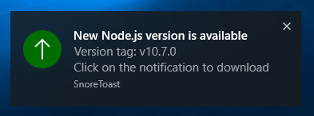

# Node.js local version updater



Every time you log in, Windows will start a background process to check whether a new version of Node.js has been published. If there is a version newer than the one installed on your machine, it will display a notification with a small description where it shows the latest tag version from the official Node.js [GitHub](https://github.com/nodejs/node) repository.

### Why only for Windows?

Since there is no auto updater on Windows (not that I know of) I had to create this Node.js app because I like to have up-to-date Node.js installed on my machine. It's not necessary to run this app on Linux and Mac since Node.js is updated through terminal on those systems.

# Install

```bash
npm i -g gimme-new-node
```

# Contribute

PR's are welcome. If you want to contribute, push the code to the **dev** branch.
